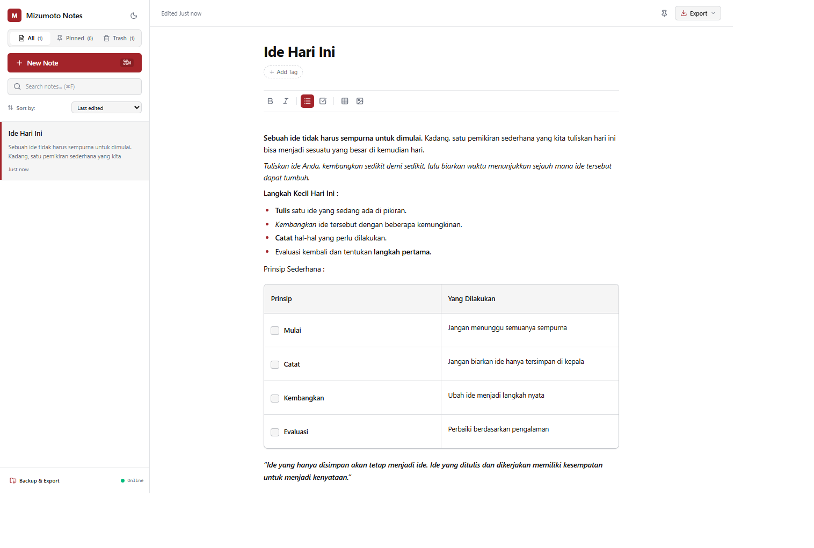

# Mizumoto Notes

A simple, powerful, offline-first note-taking Progressive Web App (PWA). Built to be intuitive enough for non-technical users while offering the features power users expect — all without requiring an internet connection or any account.

**Live demo:** [https://mizumoto-notes.vercel.app/](https://mizumoto-notes.vercel.app/) 

 (./docs/mizumoto-notes.vercel.app_2.png)

---

## ✨ Features

- **Offline-first** — all notes are stored locally in the browser (IndexedDB), no account or internet connection required after the first visit
- **Installable PWA** — install on desktop or mobile like a native app, works fully offline
- **Rich WYSIWYG editor** (powered by [Tiptap](https://tiptap.dev)) — bold, italic, bullet lists, checklists, tables, and inline images
- **Organization** — pin important notes, tag notes, search and sort your list
- **Trash / Recycle Bin** — soft delete with restore, so you never lose a note by accident
- **Dark mode** — full light/dark theme support
- **Export** — save any note as PDF (via browser print) or Markdown (.md)
- **Backup & Restore** — export all notes to a local backup file and restore them anytime, no cloud required
- **Keyboard shortcuts** — `Ctrl/Cmd + N` new note, `Ctrl/Cmd + F` search

## 🛠️ Tech Stack

| Category | Technology |
|---|---|
| Framework | React + Vite |
| Styling | Tailwind CSS |
| Rich Text Editor | Tiptap (ProseMirror) |
| Local Database | IndexedDB via Dexie.js |
| PWA | vite-plugin-pwa (Workbox) |
| Hosting | Vercel |

## 🚀 Getting Started (Local Development)

```bash
# Clone the repository
git clone https://github.com/YOUR-USERNAME/mizumoto-notes.git
cd mizumoto-notes

# Install dependencies
npm install

# Start the development server
npm run dev
```

To test PWA features (offline mode, installability), you need a production build:

```bash
npm run build
npm run preview
```

## 📦 Deployment

This project is deployed on [Vercel](https://vercel.com). Any push to the `main` branch automatically triggers a new deployment.

To deploy your own copy:
1. Fork or clone this repository
2. Import it into Vercel (Framework Preset: Vite, Build Command: `npm run build`, Output Directory: `dist`)
3. Deploy

## 🎨 Design

Mizumoto Notes uses a minimal color palette inspired by the [Mizumoto Creative Studio](https://mizumotocs.com) *(replace with your actual studio link, or remove this line)* brand identity:

| Color | Hex | Usage |
|---|---|---|
| Crimson Accent | `#A3242A` | Primary actions, active states |
| Dark | `#111111` | Text / dark mode background |
| Light | `#FFFFFF` | Background / dark mode text |
| Muted | `#6B7280` | Secondary text, borders |

## 📄 License

This project is licensed under the [MIT License](./LICENSE).

## 👤 Author

**Guruh Wicaksono**
Mizumoto Creative Studio
*(contact)*

---

*Built as a personal project to explore offline-first PWA architecture, AI-assisted development workflows, and clean UX design for non-technical users.*
